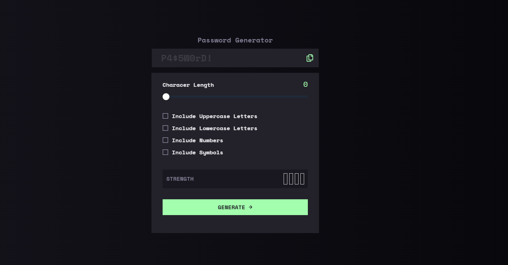
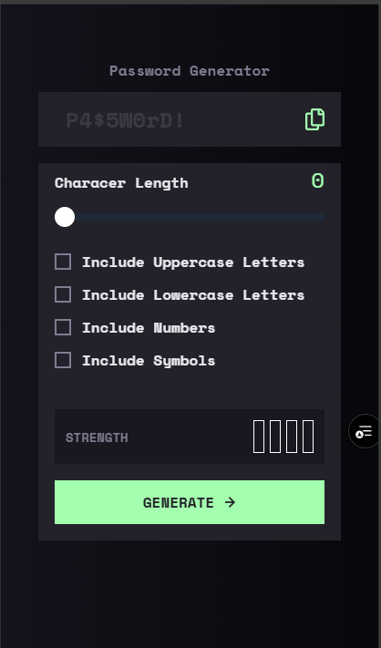

# Password Generator App 🔐

A secure and responsive password generator built with **React**, **TypeScript**, and **Tailwind CSS** — inspired by a Frontend Mentor challenge.

This project allows users to customize their password generation options with interactive UI elements, visual strength indicators, and clipboard copy functionality.

## Features

- ✅ Generate strong and customizable passwords
- ✅ Options to include uppercase, lowercase, numbers, and symbols
- ✅ Adjustable password length via slider
- ✅ Visual strength indicator (color + bars)
- ✅ One-click copy to clipboard with feedback
- ✅ Fully responsive and accessible
- ✅ Clean UI with Tailwind utility classes

## Tech Stack

- **React** – Component-based frontend architecture  
- **TypeScript** – Type safety and better developer experience  
- **Tailwind CSS** – Utility-first styling for responsive design  
- **Clipboard API** – For copy-to-clipboard functionality  
- **HTML5 + CSS3** – Semantic and accessible markup

## Tools & Techniques

- `useState` hooks for local state management  
- Custom reusable components: `CheckBox`, `InputRange`, `OutputPassword`, `PasswordStrength`  
- `Math.random()` + dynamic character pools to generate secure passwords  
- Tailwind classes like `appearance-none`, `overflow-x-auto`, `whitespace-nowrap` for custom input + slider styling  
- Conditional classnames for dynamic visual feedback  
- Component communication via props and callbacks

## Live Demo

[Live site on Vercel](https://password-generator-app-beige-three.vercel.app/) 

## Screenshots
| Desktop | Mobile |
|--------|--------|
|  |  |

## Getting Started

```bash
git clone https://github.com/seu-usuario/password-generator-app.git
cd password-generator-app
npm install
npm run dev

Folder Structure

src/
├── components/
│   ├── CheckBox.tsx
│   ├── InputRange.tsx
│   ├── OutputPassword.tsx
│   └── PasswordStrength.tsx
├── App.tsx
├── index.css

Learnings
	•	Como criar uma UI interativa com React e TypeScript
	•	Gerar senhas seguras com base em múltiplos critérios
	•	Trabalhar com estilos avançados no Tailwind (range sliders, overflow, custom thumb)
	•	Técnicas para melhorar UX com feedback instantâneo (“Copied!”)

Author
	•	GitHub: @K1dou
	•	Portfolio: kidou.tech
	•	Frontend Mentor: @K1dou

⸻

Projeto feito com amor, código limpo e obsessão por UX.
Curtiu? Me chama pra conversar sobre frontend, React, ou café.


